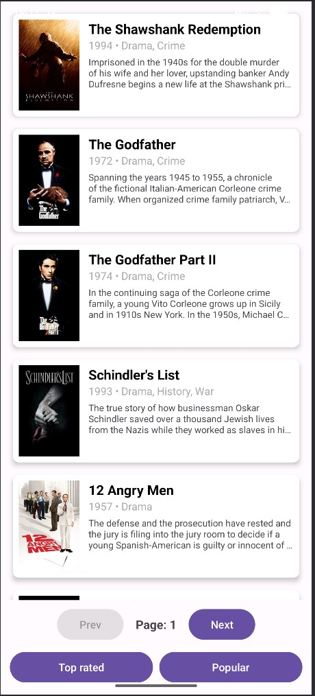
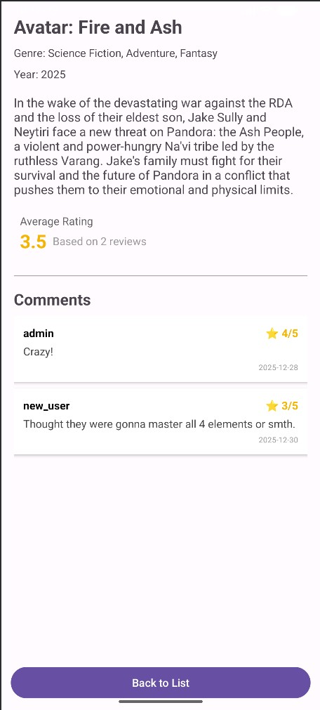

# CineScore-android
Minimalna verzija spletne aplikacije **CineScore**, ki lahko prikaže filme iz kategorij **Popular** in **Top Rated**.
Omogoča tudi ogled posameznih filmov, njegovih komentarjev in skupne ocene.

---

## Opis delovanja
Aplikacija deluje na podlagi komunikacije z REST api-jem, tako da pridobi potrebne podatke za prikaz uporabniku.
Za prenos in prejem podatkov sem uporabil knjižnico **Volley**, ki omogoča dokaj preprosto komunikacijo z api-jem,
ker pa so preneseni podatki v **JSON** formatu sem v glavnem uporabil spodaj navedene knjižnice za njihovo razčlenitev:
- org.json.JSONArray
- org.json.JSONObject
- org.json.JSONException

Vsak dostop do podatkov je zaščiten z **API ključem**, kar omogoči neko mero začite proti nepooblaščenim dostopom,
do API vmesnika. Spodaj je primer **GET** poizvedbe, ki vrne določen film na podlagi podanega **ID**:

```
curl -X 'GET' \
  'https://cinescore-webapp-arhuerfndwewhte9.germanywestcentral-01.azurewebsites.net/api/v1/movies/1' \
  -H 'accept: text/plain' \
  -H 'ApiKey: ChangeMeApiKey123!'
```

## Slike

 